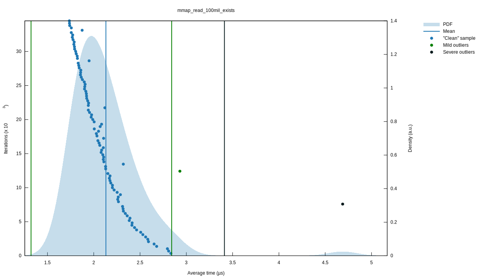
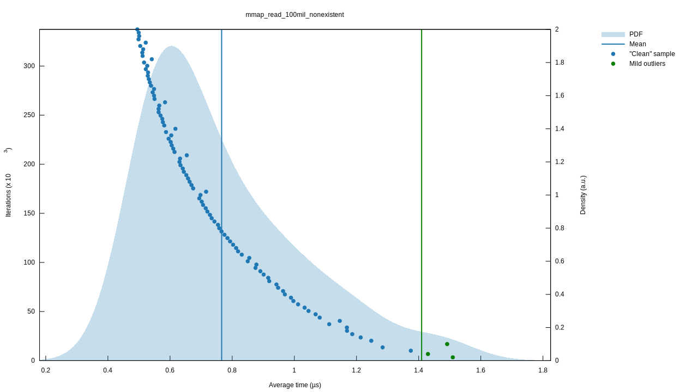

# Read-only key-value stores

Inspired by D. J. Bernstein's [cdb](https://cr.yp.to/cdb.html) and Spotify's [sparkey](https://github.com/spotify/sparkey).

Cuckoo approach based on [this](https://www.ru.is/faculty/ulfar/CuckooHash.pdf)
very approachable paper by Erlingsson, Manasse, and McSherry (vendored for
posterity at
`doc/a-cool-and-practical-alternative-to-traditional-hash-tables.pdf`).

# File format

The high-level file format here is:
```
<header>
<records>
<hashtable>
```

The file consists of `u32` values and raw byte strings. `u32` values are always encoded as little-endian.

Where `<header>` is
```
<hashtable offset> -- u32
<hashtable length> -- u32
```

and `<records>` is a bunch of key-value pairs concatenated, where each pair is
```
<key length> -- u32
<key> -- K-length byte string
<value length> -- u32
<value> -- V-length byte string
```

and `<hashtable>` is a list of `u32` entries. If an entry is `0`, it means that
slot in the hashtable is empty. If it is non-zero, it represents an offset
within the file where we should look for a key-value pair whose hash maps to
this slot.

# Cuckoo hashing constraint

The hashtable is assembled using cuckoo hashing, with two hash functions:
- `h1 = lower_32_bits(farmhash::fingerprint64(key))`
- `h2 = upper_32_bits(farmhash::fingerprint64(key))`

And we can guarantee that for any key in the database, one of `hashtable[h1 %
len(hashtable)]` or `hashtable[h2 % len(hashtable)]` is a non-zero offset that
points to the key and its associated value.

This is not an easy guarantee to provide, so assembling a valid database file is
tricky. But once we have one, querying it is very quick: we can answer any query
with at most two disk seeks.

This is a slight departure from the linear-probing approach implemented in CDB,
but I'm hoping that it results in more reliable performance.

# Reading

Parse the header, yielding `(hashtable_offset, hashtable_length)`.

Seek to `hashtable_offset` in the file, then read `hashtable_length` `u32` entries and store them in-memory as `hashtable`.

When a query comes in for some key `key`:
- hash `key` using `h = farmhash::fingerprint64(key)` and set `h1 = lower_32_bits(h)` and `h2 = upper_32_bits(h)`
- first check the slot for `h1`: `offset1 = table[h1 % len(table)]`
- if `offset1 > 0`, we may have a match, and we should double-check. Seek to `offset1` in the file, parse the `key_length`, then read in the `key` and double-check whether it matches the query. If it does, we have a match! Parse the value length, read in the value, and return it. If not, continue.
- second, check the slot for `h2`: `offset2 = table[h2 % len(table)]`
- if `offset2 > 0`, we may have a match. Seek to `offset2` in the file, parse the key, and double-check it against the query. If it matches the query, read in the value and return it.
- if we get to here, the database does not contain the given key

# Writing

When writing the file, we're going to keep an in-memory list with record metadata (the `{offset, h1, h2}` values for each record we write).

Open a file and jump ahead 8 bytes. Then start writing records, one at a time:
- remember our current `offset`
- write `len(key)` as a little-endian `u32`
- write `key` as a byte string
- write `len(value)` as a little-endian `u32`
- write `value` as a byte string
- append `{offset, h1, h2}` for this key-value pair to our in-memory list of record metadata

When we're done writing records, we need to construct the hashtable, and this is the non-trivial bit.

Assembling a cuckoo table is a fallible process. It is possible that we'll
encounter a cycle in the cuckoo graph. When that happens, we increase the size
of the cuckoo table and start over. We begin with `len(hashtable) = 2 * len(records)`
and step up to `3 * len(records)`, then `4 * len(records)`, and finally `5 * len(records)`. If we still
can't assemble a valid cuckoo table at this point, we give up.

This is a major downside of this approach. There are hypothetical datasets that we _cannot represent_. In
principle there are workarounds for this:
- we could increase the number of hash functions (from 2)
- we could allow each slot in the hashtable to contain multiple elements
- we could fall back to an infallible open addressing hashtable approach if the cuckoo strategy fails

CDB uses linear probing, Sparkey uses a modified Robinhood approach. Those are
pragmatic, but they have the downside of requiring potentially large numbers of
disk seeks when answering a query.

# Benchmarks

As of commit `28fa99049a67546fc211260910cc2b004c349bff` the MMAP-based implementation is benchmarking on my laptop at
```
mmap_read_100mil_exists time:
    [1.8716 µs 1.9001 µs 1.9355 µs]

mmap_read_100mil_nonexistent time:
    [569.58 ns 585.81 ns 606.08 ns]
```
on a 100 million element sample database.

The latency distribution for these two scenarios looks like:



Sparkey claims to get
```
Testing bulk insert of 100.000.000 elements and 1000.000 random lookups
  Candidate: Sparkey compressed(1024)
    creation time (wall):     90.50
    creation time (cpu):      90.46
    throughput (puts/cpusec): 1105412.00
    file size:                3162865465
    lookup time (wall):          3.50
    lookup time (cpu):           3.60
    throughput (lookups/cpusec): 277477.41
```
so it's looking like this approach is ~2x faster for the normal case, and ~6x
faster for the non-existent case. The normal caveats around benchmark(et)ing
apply: the Sparkey benchmarks are on a production-like server, my benchmarks are
on my laptop, I certainly didn't use the same underlying dataset or hash
functions. Their results are probably from 2010-era hardware, while my laptop is
using a 2018-era Intel chip and a new-ish NVMe SSD.

This generally matches my intuition: the major
advantage of the Cuckoo-hashing approach is that we only need to do 2 lookups in
the worst-case, whereas the Sparkey approach of Robinhood hashing requires
probing until you exceed the max_displacement threshold for the entire database.

Maybe some kind of Bloom filter approach (or a Cuckoo filter?) could be a nice
addition to the Sparkey implementation to specifically optimize queries on
non-existent keys, since those are a worst-case input.

# Potential extensions

### io_uring

I'm a bit curious about the long tail behavior, especially under highly
concurrent load. I have a nagging suspicion that MMAP is not the optimal kernel
interface. I read a bit about io_uring, which seems like a promising way to get
better performance for highly concurrent file IO.

### NVMe APIs

I also looked briefly into using the raw NVMe APIs, rather than relying on the
filesystem to seek and read blocks from the SSD. This use-case maps pretty
cleanly onto the underlying block storage device APIs, but that seems like it
would introduce some pretty significant operational complexity in terms of
actually downloading the database onto a machine. The filesystem approach means
you can download the database file directly from some cloud blob storage service
(s3, gcs) and immediately start using it.

### Writing large datasets

When writing a dataset, this approach has to keep the records in-memory, which
means that very large datasets (especially datasets with many records) require a
lot of RAM. Sparkey has a disk-based sorting approach that might be interesting
to experiment with.

### Disk-backed hashtable

The current approach requires that readers pull the entire hashtable into memory
before they can answer queries. There's no particular reason that has to be the
case. We could mmap the hashtable and then do the lookups from disk. That would
require up to 4 disk seeks in the worst case, rather than the current 2, but it
would potentially reduce the memory footprint significantly. I wonder how the
page cache would handle that type of workload.